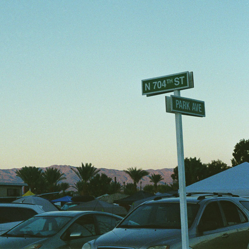
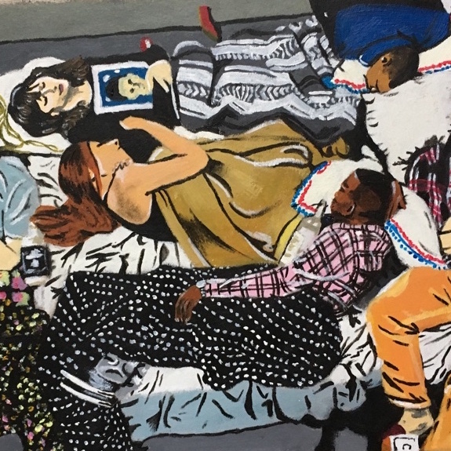

# neuralStyleTransfer
A neural style transfer with keras

# Built with
* [Keras with TensorFlow](https://keras.io/) Use to build model
* [Numpy](http://www.numpy.org/) Use to build model
* [PIL](https://pillow.readthedocs.io/en/3.1.x/index.html) Use to load ans save images
* [Scipy](https://www.scipy.org/about.html#) Use to minimize loss function

# Running

```
python3 neuralStyleTransfer.py
```
You need to change the names of images to load (base image and style image) in the code.

# Output example





# Thanks

* Keras Neural Transfer STyle code (https://github.com/keras-team/keras/blob/master/examples/neural_style_transfer.py)
