# neuralStyleTransfer
* A neural style transfer with keras
* Uses a pre-trained model : VGG16
* Doc about VGG16 [Very Deep Convolutional Networks for Large-Scale Image Recognition](https://arxiv.org/abs/1409.1556)


# Built with
* [Keras with TensorFlow](https://keras.io/) Use to build model
* [Numpy](http://www.numpy.org/) Use to build model
* [PIL](https://pillow.readthedocs.io/en/3.1.x/index.html) Use to load ans save images
* [Scipy](https://www.scipy.org/about.html#) Use to minimize loss function

# Running

```
python3 neuralStyleTransfer.py
```
You need to change the names of images to load (base image and style image) in the code.

# Output example

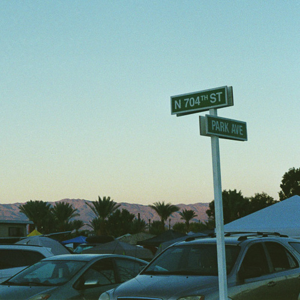
Pic by [Mona Boitière](https://www.instagram.com/monaboitiere/)

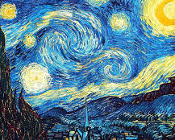 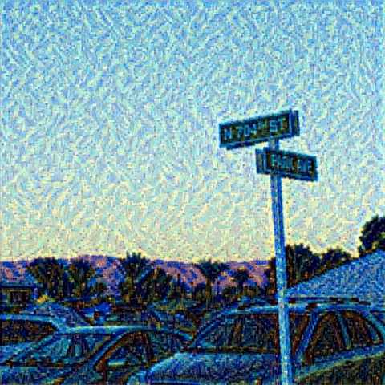
(Vincent van Gogh)
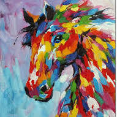 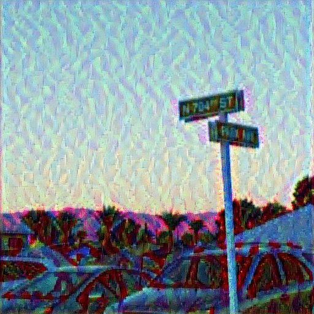
(Don't know the artist)
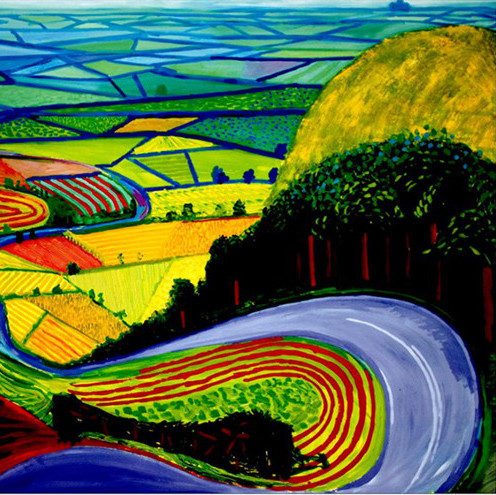 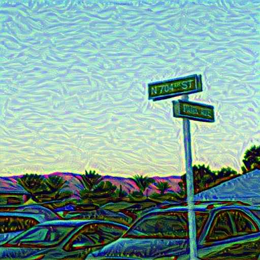
(David Hockney)

I then tried to transfer my style (from my drawings) to another picture :
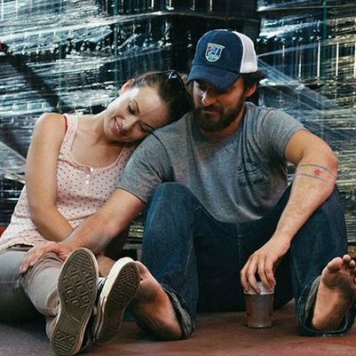
Pic from 'Drinking Buddies' movie

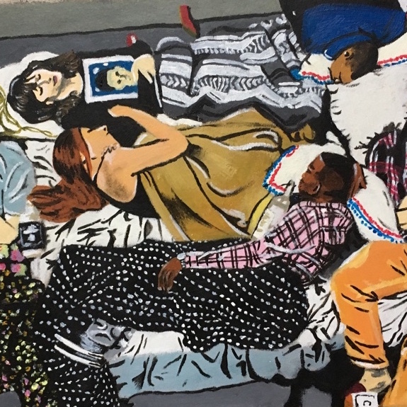 
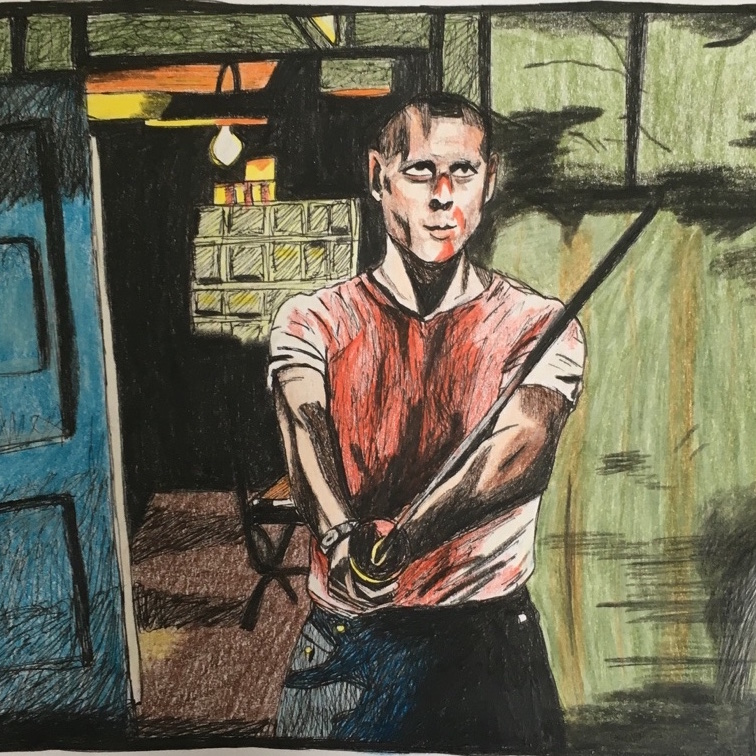 
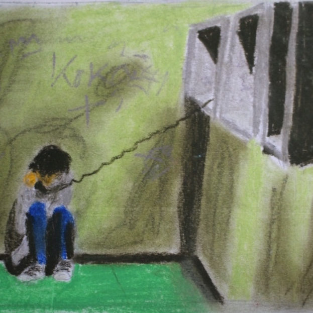 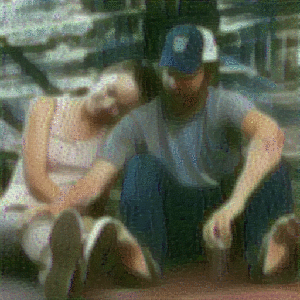
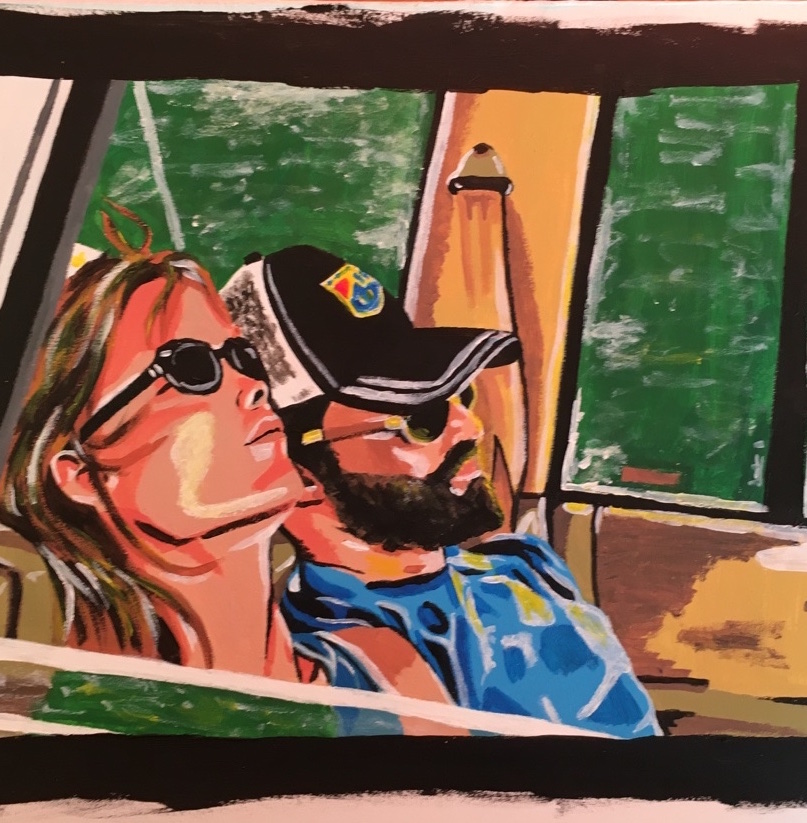 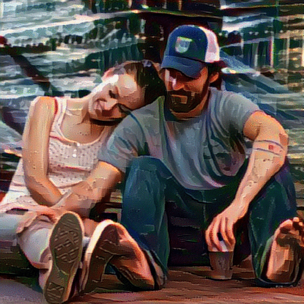

# Thanks

* Keras Neural Transfer Style code (https://github.com/keras-team/keras/blob/master/examples/neural_style_transfer.py)
